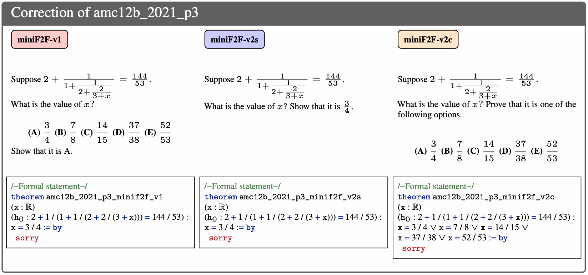

# miniF2F-Lean v2

We present two modified versions of miniF2F dataset where all the formal and informal statements match each other. The two versions that we introduce are as follows.

*miniF2F-v2c*: This is the competition level dataset where informal statements are taken from competitions such as IMO and AMC, and all the formal statements are modified/verified to match the informal statements. For example, for multiple choice questions in AMC, formal statements include all the choices and proving such theorem would require choosing the correct option. (c stands for competition.)

*miniF2F-v2s*: This is a simplified version of the miniF2F-v2c where all the informal statements are mofified to include the solutions. For example, for AMC problems, all the multiple choice questions are turned into a single option theorem where a specific solution has to be proved. Again, all formal and informal statements exactly match each other. (s stands for simplified.)

The dataset is also available on Hugging Face at: https://huggingface.co/datasets/roozbeh-yz/miniF2F_v2

## Overview of Differences Between miniF2F-v1 & v2s & v2c



## Performance of State-Of-The-Art Provers on miniF2F-v2

**Table 1:** Comparison of whole-proof generation models' accuracy on the original version of miniF2F and miniF2F-v2.

| Dataset          | Deepseek-Prover-V1.5-RL | Goedel-Prover-SFT | Kimina-Prover-Distill-7B | DeepSeek-Prover-V2-7B | Goedel-V2 |
| ---------------- | ----------------------- | ----------------- | ------------------------ | --------------------- | --------- |
| **v1-test**      | 50.0%                   | 58.2%             | 65.2%                    | 73.4%                 | 82.0%     |
| **v2s-test**     | 41.0%                   | 48.4%             | 59.0%                    | 68.1%                 | 74.2%     |
| **v2c-test**     | 38.1%                   | 46.3%             | 57.0%                    | 64.4%                 | 72.5%     |
| **v1-valid**     | 63.9%                   | 68.9%             | 73.0%                    | 79.4%                 | 83.6%     |
| **v2s-valid**    | 55.3%                   | 59.8%             | 68.0%                    | 73.4%                 | 77.9%     |
| **v2c-valid**    | 52.0%                   | 57.8%             | 67.6%                    | 70.5%                 | 73.4%     |

## Performance of State-Of-The-Art Autoformalizers on miniF2F-v2

**Table 2:** Comparison of autoformalization accuracy of Herald and Kimina translators at @128 between LLM and human evaluators. Back translation and LLM equivalence check pipeline is adopted from [Gao et al. (2025)](https://arxiv.org/abs/2410.10878).

| Translator | Evaluator              | miniF2F-v1 Test | miniF2F-v1 Valid | miniF2F-v2s Test | miniF2F-v2s Valid | miniF2F-v2c Test | miniF2F-v2c Valid |
|-------------|------------------------|----------------:|-----------------:|-----------------:|------------------:|-----------------:|------------------:|
| **Herald**  | Herald’s automated judge | 97.5% | 97.1% | 96.7% | 97.5% | 95.1% | 97.1% |
| **Herald**  | Human                  | 62.7% | 69.7% | 66.0% | 68.9% | 54.1% | 60.2% |
| **Kimina**  | Herald’s automated judge | 98.4% | 98.4% | 99.6% | 98.8% | 98.4% | 98.8% |
| **Kimina**  | Human                  | 90.6% | 88.1% | 91.0% | 88.1% | 75.4% | 76.6% |


## Performance of Full Autoformalizer-Prover Pipelines on miniF2F-v2

**Table 3:** Comparison of effective accuracy across different autoformalizers and theorem provers. Effective accuracy = final accuracy after autoformalizer + theorem prover pipeline. Experiments: **@128** for translators, **@32** for theorem provers.  

<small>

| Autoformalizer | miniF2F Ver. | Split | Verification Setting | Deepseek-Prover-V1.5-RL | Goedel-Prover-SFT | Kimina-Prover-Distill-7B | DeepSeek-Prover-V2-7B | Goedel-V2-7B |
|----------------|---------------|--------|-----------------------|-------------------------:|------------------:|--------------------------:|----------------------:|--------------:|
| **Herald translator** | v1 | test | Full score¹ | 34.4 | 37.7 | 41.0 | 50.8 | 54.1 |
|  | v2s | test | Full score | 34.0   | 37.7 | 42.2   | 47.5   | 53.3   |
|  | v2c | test | Full score | 33.2   | 36.9   | 39.3   | 43.4   | 48.4   |
|  | v1 | test | No score (Olympiad²) | 21.7 | 24.2 | 27.5 | 33.2 | 36.9 |
|  | v2s | test | No score (Olympiad) | 31.1   | 34.8   | 38.9   | 44.7   | 50.0   |
|  | v2c | test | No score (Olympiad) | 30.3   | 34.0   | 36.5   | 40.6   | 44.7   |
|  | v1 | valid | Full score | 43.0 | 47.1 | 50.0 | 62.7 | 64.3 |
|  | v2s | valid | Full score | 43.0 | 46.3   | 50.0 | 58.6   | 59.4   |
|  | v2c | valid | Full score | 41.4   | 43.4   | 46.3   | 52.9   | 53.3   |
|  | v1 | valid | No score (Olympiad) | 31.6 | 34.4 | 36.9 | 44.7 | 46.7 |
|  | v2s | valid | No score (Olympiad) | 40.2   | 43.4   | 47.1   | 55.7   | 56.1   |
|  | v2c | valid | No score (Olympiad) | 38.5   | 40.6   | 43.4   | 50.0   | 51.2   |
| **Kimina autoformalizer** | v1 | test | Full score | 42.2 | 48.0 | 60.2 | 69.7 | 77.5 |
|  | v2s | test | Full score | 43.9   | 47.6   | 62.3   | 63.5   | 74.2   |
|  | v2c | test | Full score | 40.6   | 46.7   | 56.1   | 55.7   | 65.6   |
|  | v1 | test | No score (Olympiad) | 24.2 | 27.9 | 35.2 | 40.2 | 49.2 |
|  | v2s | test | No score (Olympiad) | 41.8   | 47.5   | 58.6   | 60.2   | 69.7   |
|  | v2c | test | No score (Olympiad) | 38.1   | 44.3   | 52.0   | 52.5   | 61.5   |
|  | v1 | valid | Full score | 52.0 | 55.3 | 64.8 | 75.4 | 78.7 |
|  | v2s | valid | Full score | 51.6   | 52.8   | 65.6   | 72.1   | 74.6   |
|  | v2c | valid | Full score | 47.5   | 52.0   | 60.7   | 63.5   | 66.4   |
|  | v1 | valid | No score (Olympiad) | 38.1 | 40.6 | 46.7 | 51.2 | 54.9 |
|  | v2s | valid | No score (Olympiad) | 48.0   | 52.0   | 61.1   | 68.4   | 70.1   |
|  | v2c | valid | No score (Olympiad) | 43.9   | 48.4   | 56.6   | 60.2   | 62.3   |

</small>
---

¹ In this setting, simplification is rewarded, even excessively simplified proofs receive full credit.  
² Olympiad setting: excessively simplified proofs receive no or minimal credit; other simplifications receive full credit.

## Bibtex Citation
```bibtex
@inproceedings{
  ospanov2025minifflean,
  title={miniF2F-Lean Revisited: Reviewing Limitations and Charting a Path Forward},
  author={Azim Ospanov and Farzan Farnia and Roozbeh Yousefzadeh},
  booktitle={The Thirty-ninth Annual Conference on Neural Information Processing Systems},
  year={2025},
  url={https://openreview.net/forum?id=KtaHv0YUyh}
}
```


